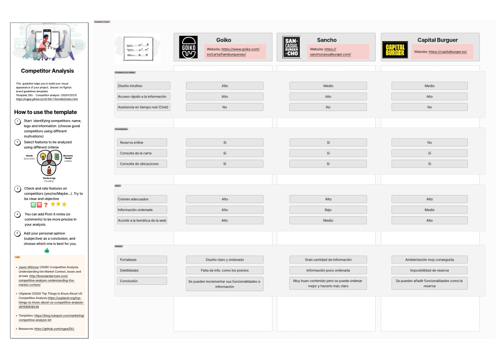

## 1. User Research Plan

**Target website for the study:** Goiko — https://www.goiko.com/es/carta/hamburguesas/

**Motivation and context:**
We are frequent users of this type of business and, therefore, have a close familiarity with the domain. The primary objective of the research is to improve the user experience when using this website to increase the customer base and sales volume.

**Key features to evaluate:**
- Making a reservation.
- Checking restaurant locations.
- Reviewing product prices, ingredients, and allergens.

**Methodology:**
A combination of qualitative and quantitative information will be used:
- User interviews to identify difficulties when using similar platforms.
- Task-based testing: asking users to perform the most frequent actions (booking a table, choosing a burger based on available information, finding a location) while timing the process to obtain quantitative usability metrics (time taken, errors made, confusing steps).

**Participants:**
Participants will range across different age groups (from teenagers to older adults) and feature varying levels of experience using restaurant platforms (novice and expert users).

**Expected outcome:**
A usability report identifying areas for improvement to optimize the website experience.

---

## 2. Competitor Analysis
[CompetitorAnalisisFigma_pdf](../CompetitiveAnalysis/Competitor_Analysis.pdf)

**Selected competitors:**

- Sancho Casual Burger — https://sanchocasualburger.com/
- Capital Burger — https://capitalburger.es/

**Criteria and method:**
A series of criteria related to user experience were evaluated across each website: existing information and features, clarity and ease of access to information, visual design, and content organization. The ratings used in the original analysis were "low/medium/high," and certain criteria were evaluated as yes/no (presence/absence of functionality).

**General observations extracted:**
- Competitor websites offer similar functionalities and information.
- In terms of clarity and information organization, the target site (Goiko, in the study) is perceived as superior to the rest.
- However, the site can improve the information provided to users: key data such as product pricing is missing.

**Competitive analysis conclusion:**
The studied site shows good practices in clarity and organization; nevertheless, incorporating missing information (e.g., prices) and learning from competitors' strengths (e.g., Capital Burger's atmosphere and product presentation) will help improve conversion and the overall experience.

---

## 3. Practical Recommendations (derived from the analysis)
- Include clear pricing per product on product cards or the online menu.
- Display ingredient and allergen information prominently for each product.
- Facilitate booking and/or ordering directly from the product card or local landing pages (micro-conversions).
- Track task completion times during user testing to obtain comparable metrics and detect bottlenecks.
