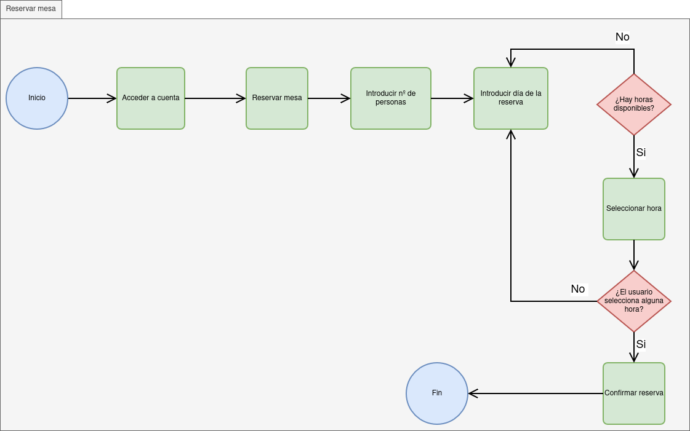
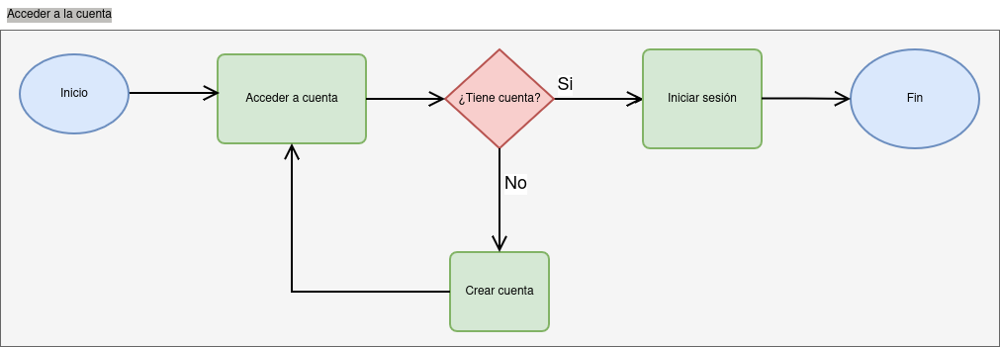
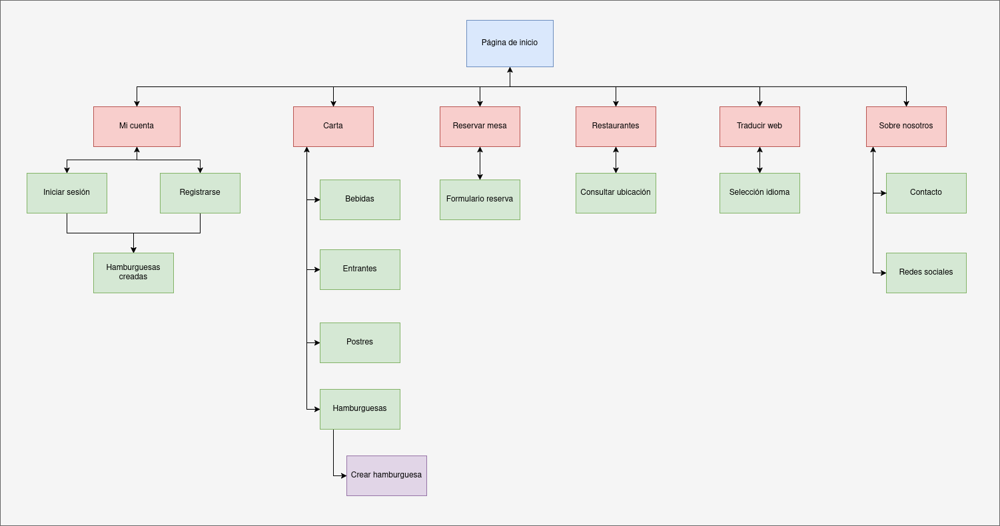
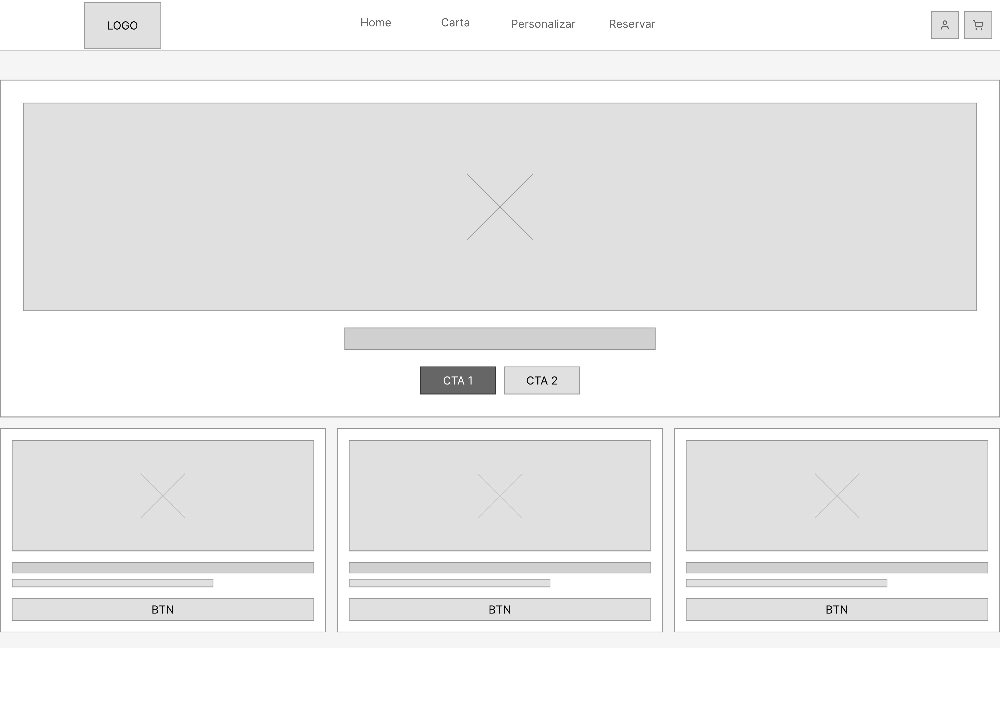
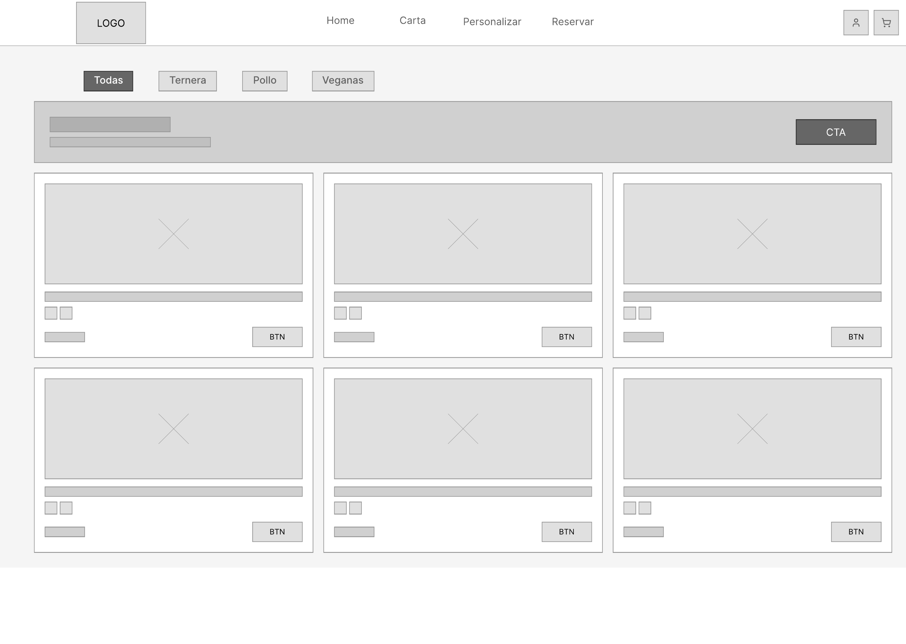

## Ideation & Design

We have defined the value proposition and core structure for our project, focusing on burger customization and reservation optimization.

### Ideation

As our ideation technique, we used an **Empathy Map** to delve into the behavior and needs of our target users, clearly identifying what they think, feel, hear, see, say, and do, as well as their main frustrations and motivations.

* **Empathy Map:**
.png)

### Value Proposition

We defined our value proposition using the **Scope Canvas**, establishing our goals, user needs, and the key features the platform must have to satisfy them.

* **Scope Canvas:**
%20(Copy)%20(Copia).png)

### Task Analysis (User / Task Flow)

Below is the analysis of the primary and most critical user tasks on our platform. We modeled the following user flows:

* **Create Burger:** Flow for customizing and ordering a burger.

* **Book a Table:** Optimized flow to ensure a quick and frictionless reservation.

* **Access Account:** Basic user authentication flow.

### Information Architecture

Logical organization of information, navigation, and labeling presented to the user.

* **Sitemap:**

* **Labelling:**
The agreed-upon terms and their definitions are detailed in the attached document:  
[View Labelling (PDF)](Labelling.pdf)

### Lo-Fi Wireframe Prototype

Based on the defined user flows and information architecture, we sketched the initial low-fidelity wireframes for the system's main screens. 

The design focuses on a desktop format (1440px width) using a structured 12-column grid layout. Working in grayscale with purely structural elements, we prioritized establishing visual hierarchy, data placement (allergens, pricing), and usability over aesthetic impact.

Linked below are the documents and designs for the most representative screens and flows of our platform:

* **Landing Page (Home):** Initial design of the welcome screen.

* **Menu Page:** Displaying products with an emphasis on price clarity and allergen tags.

* **Burger Customizer:** Split-screen interface to configure the dish from scratch.

* **Booking Process:** Simplified screen for securing a table via form submission.

### Conclusions

In this design phase, we established the conceptual and structural foundations of our proposal. By combining user empathy with task-centered analysis (such as booking or customizing a burger), we mapped a clear navigation flow that serves as the basis for the wireframes. The information architecture directly addresses the shortcomings identified in the initial phase (such as a lack of product transparency).
