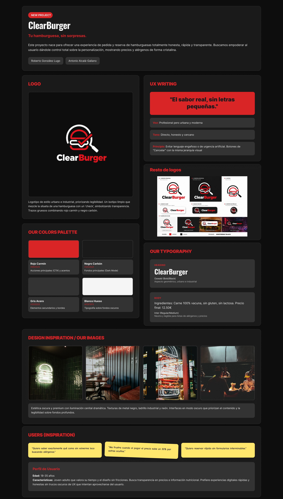
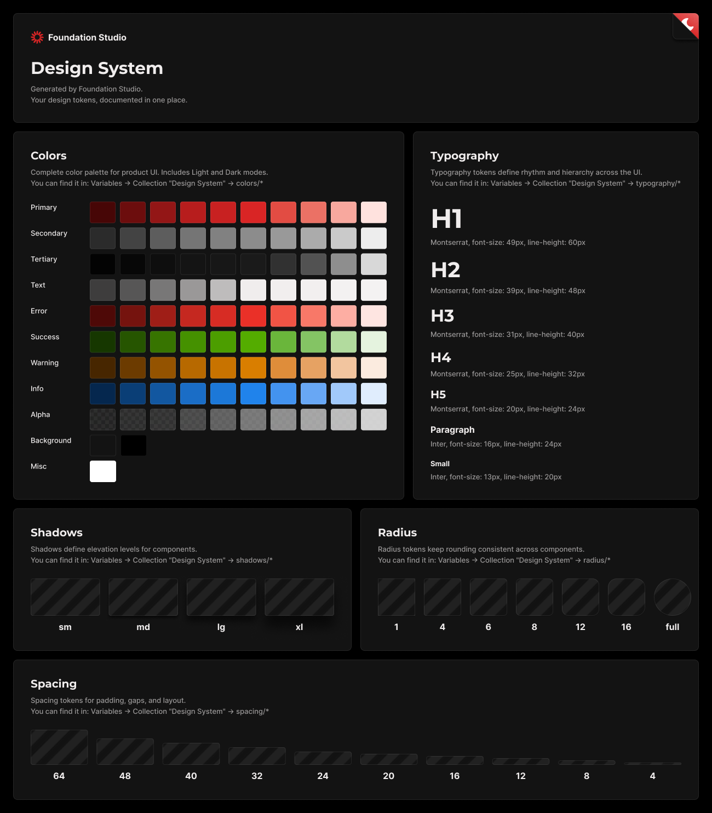
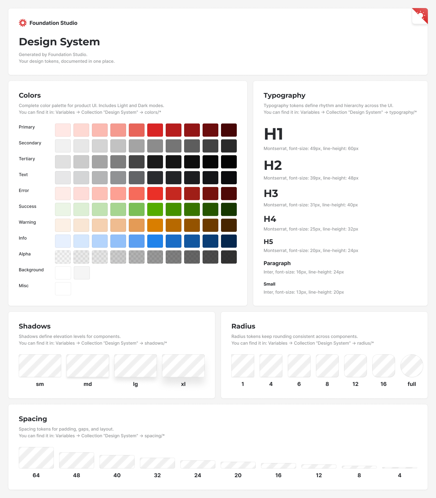
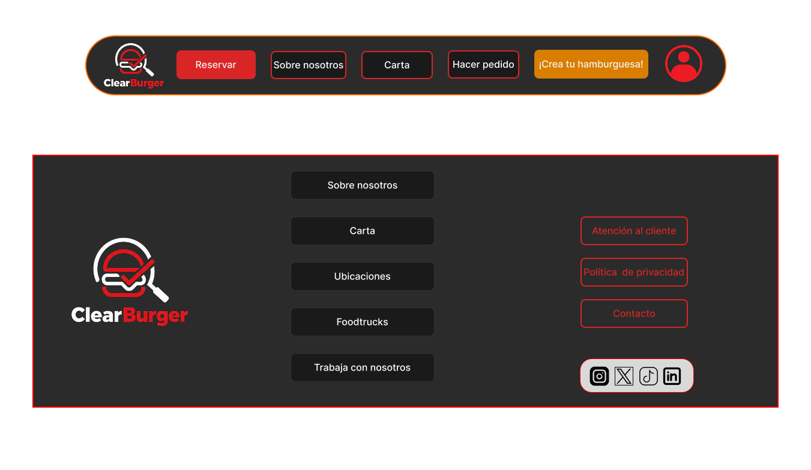
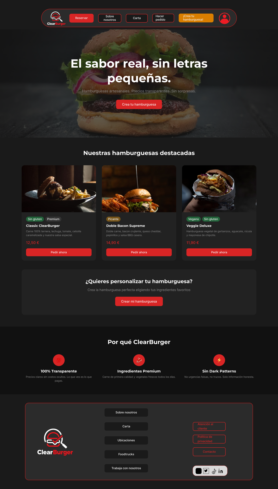
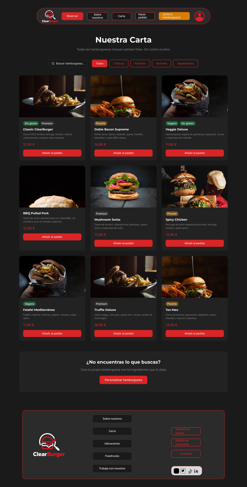
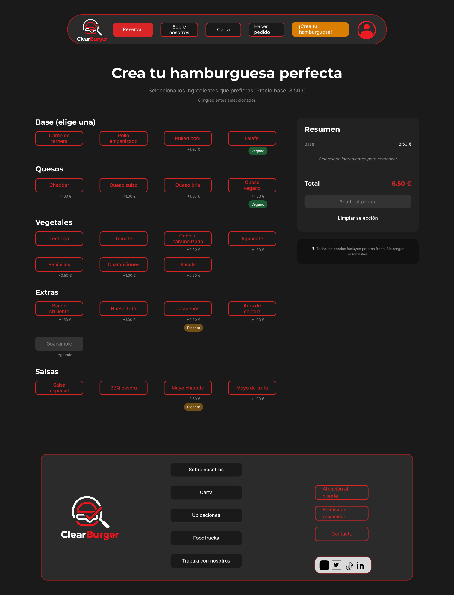

# Moodboard

**Final Moodboard File:** [Download/View PDF](Moodboard-P3_DarkPatterns.pdf)

**Moodboard Link in Figma:** [View Full Moodboard (Figma)](https://www.figma.com/design/eV5CyeyMHPOjrAd9HuXekq/Untitled?node-id=0-1&t=M9fE7HbpVGV4a53N-1)

### 1. Project and Objectives
**Title:** ClearBurger — Your burger, no surprises.

This project was created to offer a completely honest, fast, and transparent burger ordering and reservation experience. We aim to empower the user by granting full control over product customization, displaying prices and allergens with crystal clarity. The main goal is to eliminate the frustration of common "dark patterns" found in other food delivery applications, proving that a good interface can be both ethical and profitable.

**Authors:** Roberto González Lugo and Antonio Alcalá-Galiano Sánchez

### 2. Visual Identity and Logo

Our logo relies on an urban, industrial style, prioritizing legibility at all times. We designed a clean, thick-lined logomark that accompanies the brand, combining red and black to convey energy, modernity, and solidity.

### 3. UX Writing (Voice and Tone)
**Main Slogan:** *"Real flavor, no fine print."*

For the interface copy, we chose to be direct, honest, and approachable, avoiding deceptive language or artificial urgency (such as typical messages like "Book now, only 2 tables left!").
* **Voice:** Professional yet urban and modern.
* **Tone:** Transparent, clear, and highly respectful of the user's time.
* In practice, this translates into balanced buttons (the "Cancel" option has the same visual weight as the confirmation) and straightforward messaging like "Add ingredients (from +€0.50)".

### 4. Color Palette
Our palette draws inspiration from a nighttime setting and classic fast-food tones, offering a modern contrast for an elegant Dark Mode.
* **Carmine Red (#D92525):** Primary call-to-action (CTA) color that stimulates appetite and denotes energy.
* **Carbon Black (#1A1A1A):** Background color used to structure the layout, giving a premium feel.
* **Steel Gray (#333333 and #8C8C8C):** Neutral tones for borders and disabled/secondary typography.
* **Bone White (#F5F5F5):** Used for typography on dark backgrounds to ensure visual accessibility.

### 5. Typography
We selected a robust, highly legible Sans-Serif typographic system:
* **Heading:** *Montserrat* (Bold). Its geometric and condensed look blends perfectly with our target industrial aesthetic, giving immense strength to titles.
* **Body:** *Inter* (Regular/Medium). A highly neutral font, essential for ensuring ingredients lists, allergens, and prices are clearly readable on screen.

### 6. Visual Inspiration
For the graphic elements, we drew inspiration from food photography featuring burgers against dark backgrounds with wood or brick textures. The concept is for the interface to look like a premium application supported by clean cards to facilitate navigation without distracting from the final product.

### 7. User Focus
We based our design decisions on our Empathy Map (developed during the discovery phase). We cater to young adults accustomed to delivery apps who value a friction-free process. We started from actual or latent verbalizations identified during user research:
* *"I always have trouble finding allergens; I want to know what I'm eating without searching everywhere."*
* *"I hate going to pay and seeing that the price has magically jumped 30% due to pre-selected extra charges."*

---

# Landing Page

**Landing Page Link:** [View Landing Page](https://trade-editor-25618488.figma.site)

The Landing Page was generated using **Figma Make** (Figma's vibe coding/design tool), applying the visual language defined in the Moodboard: a dark mode palette, Montserrat/Inter typography, and a transparent, direct voice. The process involved defining prompts detailing the objective, style, and key content (main CTA, benefits, headline), iterating on the results to fine-tune visual hierarchy and brand colors.

---

# Design System

**Design System Link in Figma:** [View Full Design System](https://www.figma.com/design/hSSaOkXlwwd5DqxbSwdTj9/Design-system?node-id=0-1&t=3GDIyxNABywiV3ie-1)

The ClearBurger Design System is built following the **Atomic Design** methodology, starting from base visual tokens (Foundations) up to complete reusable organisms in the Hi-Fi Layout.

## Foundations

Base visual system generated with the **Foundation Studio** plugin for Figma. It includes semantic color ramps (Primary, Secondary, Neutrals, Error, Success, Warning), a modular typographic scale (H1–H5, Paragraph, Small), a shadow system, corner radii, and an 8px grid-based spacing system.

**Dark Mode:**

**Light Mode:**

## Atoms

Minimal, indivisible components featuring Figma variants and Auto Layout:

- **Button:** 4 variants (Primary / Secondary / Disabled / Ghost). Padding 12px vertical / 24px horizontal.
- **Input:** 3 states (Default / Focus / Error). Padding 12px vertical / 16px horizontal.
- **Badge / Allergen Tag:** 3 variants (Default / Warning / Positive). Padding 4px vertical / 10px horizontal.

## Molecules

Compositions of atoms designed for recurring interface patterns:

- **Search Bar:** 3 states (Default / Focus / Filled)
- **List Item:** 5 simple variants + 5 variants with allergen badges
- **Product Card:** 3 variants (image + name + price + Order button)

## Organisms

- **Navbar:** ClearBurger logo + main navigation (Reservations, About us, Menu, Place order, Build your burger) + user avatar
- **Footer:** Logo + secondary navigation + legal links + social media icons

---

# Hi-Fi Layout

The Hi-Fi Layout brings together the four main screens of **ClearBurger** in high fidelity, applying the complete Design System: Navbar and Footer components, product cards, search bar, list items with allergen tags, and forms. Designed in a desktop format (1440px) featuring dark mode and semantic visual hierarchy (header → content → footer) across all screens.

**Published Interactive Prototype:** [View Prototype](https://dazzle-pages-38852614.figma.site)

**Figma File (Static):** [View Design in Figma](https://www.figma.com/design/hSSaOkXlwwd5DqxbSwdTj9/Design-system?node-id=69-17&t=3GDIyxNABywiV3ie-1)

---

### Home

Welcome screen featuring a hero section, featured burgers section, and main call-to-action.

[Download PDF](ExportsFigma/Layout-Home.pdf)

---

### Menu

Full product catalog featuring a search bar, allergen filters, and a grid of product cards.

[Download PDF](ExportsFigma/Layout-Carta.pdf)

---

### Burger Customizer

Customization screen featuring an ingredient selector (list items with allergen badges) and a real-time order summary with transparent pricing.

[Download PDF](ExportsFigma/Layout-Customizar.pdf)

---

### Table Reservation

Streamlined multi-step booking form, free of pre-selected information or hidden charges.

[Download PDF](ExportsFigma/Layout-Reservar.pdf)

---

## Conclusions

This phase marked the leap from structural design to a fully realized visual prototype, proving to be a rewarding experience overall. Building a custom Design System from scratch forces consistency decisions regarding colors, spacing, and typography right from the start. These choices pay off immensely when composing screens: components snap into place, spacing is respected, and the final output achieves genuine visual coherence.

The greatest learning curve involved mastering Figma at a deeper level: variants, Auto Layout, constraints, and Prototype mode are features that require dedicated practice. In this regard, leveraging conversational AI tools (like ChatGPT and Claude) to resolve technical Figma queries kept us from getting blocked and maintained our momentum.

As an area for improvement, given more time we would have refined the prototype transitions and added more interaction states to components (hover, pressed). Even so, the resulting work faithfully reflects ClearBurger's core value proposition: an honest, clean interface free of dark patterns.
