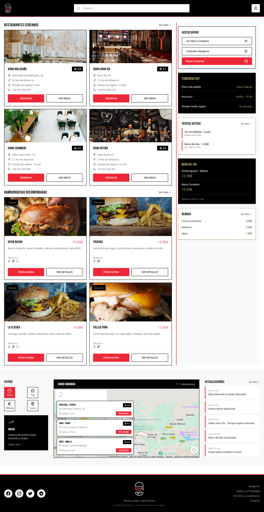
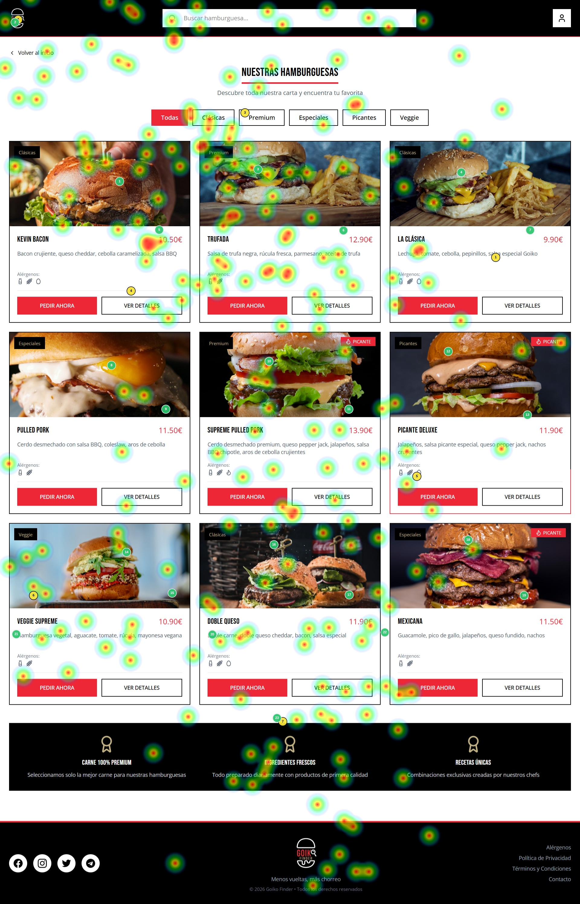
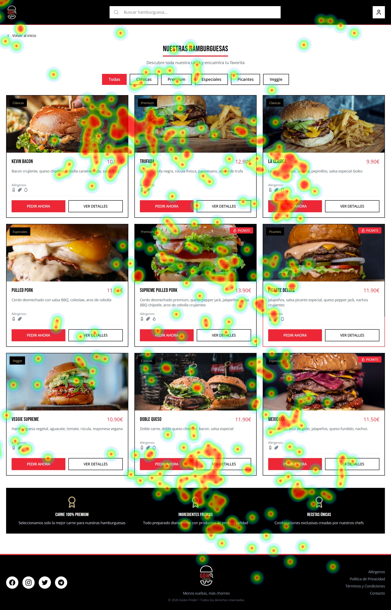
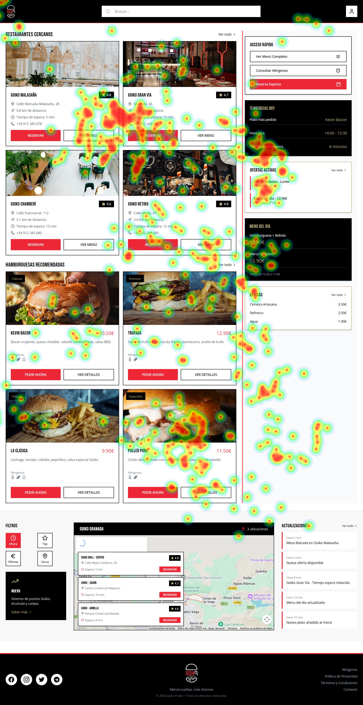
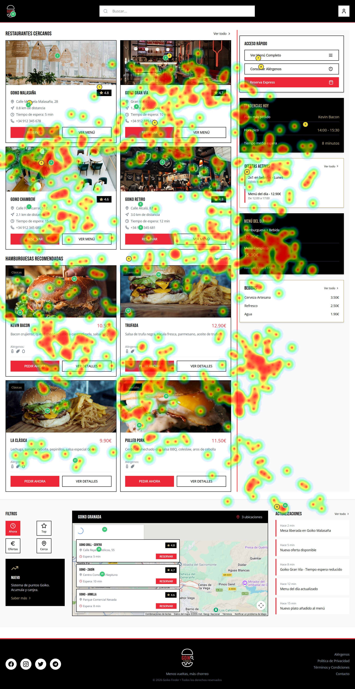
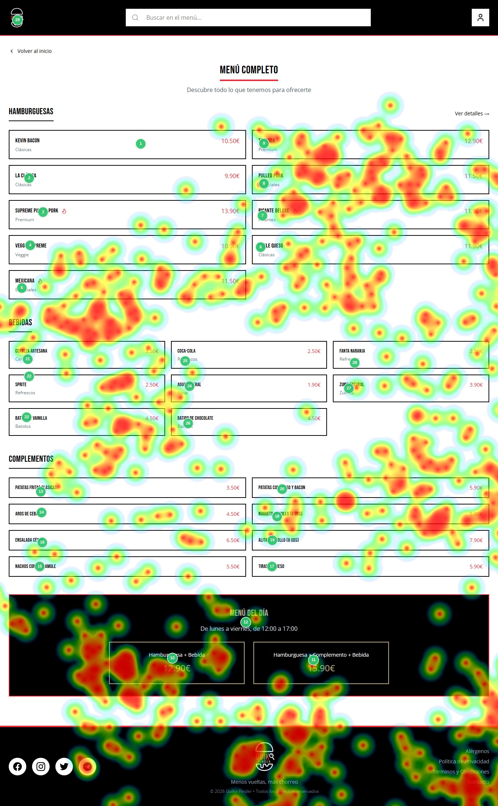

## RECRUITMENT

To carry out this phase, due to time constraints, we were able to assemble a sample of 5 users, of which 3 were key users who underwent the Eye Tracking test. The participant details are:

| ID | Age | Gender | Digital Literacy |
| :---- | :---- | :---- | :---- |
| P1 | 21 | Male | High |
| P2 | 21 | Male | High |
| P3 | 52 | Female | Medium |

Regarding the conditions under which the eye-tracking test was conducted, all users removed their glasses if they wore them, meaning everyone performed the test with an uncovered face. Lighting was natural, and the test was performed on a laptop.   

The first two users are classmates, so they are familiar with this type of test as they are studying them as well. The other two have never participated and are not familiar with them at all. P1 and P2 are students, while P4 can be considered an end-user, as someone without computer science knowledge who frequently uses this type of web page.  

On the other hand, to carry out the rest of the tests, the 3 users evaluated both cases, but 2 of them evaluated Case B first, and the remaining one evaluated Case A first.

---

## EYE TRACKING

The images we will use to evaluate our peers' website (simulating a competitor analysis) via Gaze mapping are the following:

Regarding points of interest, we selected the parts we considered most important on the website due to the information they provide, which are: food and venue photography, prices, the restaurant location map, and the names of each menu component...

Regarding the actions the user had to perform, we asked them to browse the website as if they were interested in ordering a burger, and to carry out tasks such as finding the reservation button, allergens, different locations, or establishment availability. In this way, we aim to have them investigate information such as prices, ingredients, or locations...

The heatmap results for the different participants were as follows:

**P1:**

We can observe that this user glanced over the entire website very quickly, analyzing every detail and focusing primarily on cards for both burgers and restaurants. It is also clear that they barely looked at the map, so this feature went completely unnoticed by them.

**P2:**

Analyzing this user, we realized they looked primarily at the photos, and in some cases also paid close attention to the information. Thus, we assume this user tends to focus on images and, if they catch their attention, moves on to read the details of the product or establishment. Something similar happened in the menu, as they focused on very specific parts rather than analyzing everything.

**P3:**

Lastly, we have subject P3, who, as we can see, looked at everything with extreme attention, both images and text. In the menu, they also looked at practically every option.

**Eye Tracking Conclusions:**
In conclusion, evaluating the three cases, we can infer that younger people, perhaps due to being more familiar with technology, tend to pay much less attention to content and look at everything much faster, focusing only on what interests them. On the other hand, as we can see thanks to P3, slightly older people with less digital experience tend to pay close attention to all details, since they do not know exactly what is important and what is not. 

Thus, we believe the most appropriate approach would be to try simplifying the design slightly to better accommodate less familiar users, reducing the number of items they have to look at and clearly highlighting what is most important. Our recommendations for improvement would be:
1. Reduce the items in the grid and make them larger, so they stand out more and the interface is simpler. The text description and the "show details" button are very appropriate, as they contribute to this simplicity (since you only see details if the burger catches your attention). The right sidebar menu also seems like a very good idea, as it provides a lot of information in a very quick and easy-to-read format.
2. The menu section would improve significantly if it included photographs to make it more visual, since text-only layouts can become very monotonous and difficult for some users to understand.
3. Finally, we noticed that none of the 3 subjects paid much attention to the map section. Since this is quite an important feature, it could be made more prominent to draw attention—for example, by using brightly colored pins indicating exact locations and placing restaurant info in a spot that does not obstruct the content.

On the other hand, we observed that users correctly focused on the points of interest, although as mentioned before, the map (which was one of them) acted as a silent zone where they barely looked.

---

## TESTS AND SUS QUESTIONNAIRE

We now move on to the user usability testing of the designs. The tasks assigned to them are:  
* **Case A: Our website (Burger Creator):** The user is asked to imagine they are going to dine at Goiko and want to create a burger that fully fits their tastes and allergen requirements.  
* **Case B: Competitor website (Goiko Finder):** The user is asked to choose the burger and location they like best for an upcoming meal.

### Case A SUS Questionnaire

**P1:**
| | Questions | 1 | 2 | 3 | 4 | 5 |
| :---- | :---- | :---- | :---- | :---- | :---- | :---- |
| 1 | I think that I would like to use this system frequently | | | | | x |
| 2 | I found the system unnecessarily complex | | x | | | |
| 3 | I thought the system was easy to use | | | | | x |
| 4 | I think that I would need the support of a technical person to be able to use this system | | x | | | |
| 5 | I found the various functions in this system were well integrated | | | | x | |
| 6 | I thought there was too much inconsistency in this system | x | | | | |
| 7 | I would imagine that most people would learn to use this system very quickly | | | | x | |
| 8 | I found the system very cumbersome to use | | | x | | |
| 9 | I felt very confident using the system | | | | x | |
| 10 | I needed to learn a lot of things before I could get going with this system | x | | | | |

**P2:**  
| | Questions | 1 | 2 | 3 | 4 | 5 |
| :---- | :---- | :---- | :---- | :---- | :---- | :---- |
| 1 | I think that I would like to use this system frequently | | | | | x |
| 2 | I found the system unnecessarily complex | x | | | | |
| 3 | I thought the system was easy to use | | | | x | |
| 4 | I think that I would need the support of a technical person to be able to use this system | x | | | | |
| 5 | I found the various functions in this system were well integrated | | | | x | |
| 6 | I thought there was too much inconsistency in this system | x | | | | |
| 7 | I would imagine that most people would learn to use this system very quickly | | | | | x |
| 8 | I found the system very cumbersome to use | | x | | | |
| 9 | I felt very confident using the system | | | | | x |
| 10 | I needed to learn a lot of things before I could get going with this system | x | | | | |

**P3:**  
| | Questions | 1 | 2 | 3 | 4 | 5 |
| :---- | :---- | :---- | :---- | :---- | :---- | :---- |
| 1 | I think that I would like to use this system frequently | | | | | x |
| 2 | I found the system unnecessarily complex | | x | | | |
| 3 | I thought the system was easy to use | | | x | | |
| 4 | I think that I would need the support of a technical person to be able to use this system | | x | | | |
| 5 | I found the various functions in this system were well integrated | | | | x | |
| 6 | I thought there was too much inconsistency in this system | x | | | | |
| 7 | I would imagine that most people would learn to use this system very quickly | | | | x | |
| 8 | I found the system very cumbersome to use | | | x | | |
| 9 | I felt very confident using the system | | | | x | |
| 10 | I needed to learn a lot of things before I could get going with this system | | x | | | |

**SUS Summary - Case A:**
| User | SUS Score | Linguistic Rating |
| :---- | :---- | :---- |
| P1 | 82.5 | Excellent |
| P2 | 92.5 | Best Imaginable |
| P3 | 75 | Good |

---

### Case B SUS Questionnaire

**P1:**
| | Questions | 1 | 2 | 3 | 4 | 5 |
| :---- | :---- | :---- | :---- | :---- | :---- | :---- |
| 1 | I think that I would like to use this system frequently | | | | | x |
| 2 | I found the system unnecessarily complex | | x | | | |
| 3 | I thought the system was easy to use | | | | | x |
| 4 | I think that I would need the support of a technical person to be able to use this system | x | | | | |
| 5 | I found the various functions in this system were well integrated | | | x | | |
| 6 | I thought there was too much inconsistency in this system | | x | | | |
| 7 | I would imagine that most people would learn to use this system very quickly | | | x | | |
| 8 | I found the system very cumbersome to use | | | | x | |
| 9 | I felt very confident using the system | | | | x | |
| 10 | I needed to learn a lot of things before I could get going with this system | x | | | | |

**P2:**  
| | Questions | 1 | 2 | 3 | 4 | 5 |
| :---- | :---- | :---- | :---- | :---- | :---- | :---- |
| 1 | I think that I would like to use this system frequently | | | | | x |
| 2 | I found the system unnecessarily complex | | x | | | |
| 3 | I thought the system was easy to use | | | | x | |
| 4 | I think that I would need the support of a technical person to be able to use this system | x | | | | |
| 5 | I found the various functions in this system were well integrated | | | | x | |
| 6 | I thought there was too much inconsistency in this system | x | | | | |
| 7 | I would imagine that most people would learn to use this system very quickly | | | x | | |
| 8 | I found the system very cumbersome to use | | | x | | |
| 9 | I felt very confident using the system | | | | | x |
| 10 | I needed to learn a lot of things before I could get going with this system | x | | | | |

**P3:**  
| | Questions | 1 | 2 | 3 | 4 | 5 |
| :---- | :---- | :---- | :---- | :---- | :---- | :---- |
| 1 | I think that I would like to use this system frequently | | | | | x |
| 2 | I found the system unnecessarily complex | | | x | | |
| 3 | I thought the system was easy to use | | | x | | |
| 4 | I think that I would need the support of a technical person to be able to use this system | | x | | | |
| 5 | I found the various functions in this system were well integrated | | | | x | |
| 6 | I thought there was too much inconsistency in this system | | x | | | |
| 7 | I would imagine that most people would learn to use this system very quickly | | | | x | |
| 8 | I found the system very cumbersome to use | | | | x | |
| 9 | I felt very confident using the system | | | | x | |
| 10 | I needed to learn a lot of things before I could get going with this system | | x | | | |

**SUS Summary - Case B:**
| User | SUS Score | Linguistic Rating |
| :---- | :---- | :---- |
| P1 | 75 | Good |
| P2 | 82.5 | Excellent |
| P3 | 67.5 | Good |

---

## A/B TESTING

We will perform the same tests as in the previous section:

**Case A:**
| User | Success | Time |
| :---- | :---- | :---- |
| P1 | Yes | 45s |
| P2 | Yes | 51s |
| P3 | Yes | 1m 10s |

**Case B:**
| User | Success | Time |
| :---- | :---- | :---- |
| P1 | Yes | 25s |
| P2 | Yes | 32s |
| P3 | Yes | 47s |

We can observe that both websites are sufficiently well-designed for users to successfully accomplish what is requested of them. It can be seen that Case B times are somewhat faster, but we believe this is because the Case A task is somewhat more complex and lengthy.

---

## COMPETITOR USABILITY REPORT

Usability Evaluation of the Goiko Finder Project

### Executive Summary

In this analysis, we evaluated the Goiko Finder proposal, whose functionality is based on simplifying navigation across Goiko's website and making it much clearer and faster.   

The main aspects evaluated were website clarity across users of different ages and levels of technical familiarity, as well as its interface usability.  

To achieve this, users performed several tests. The first was Gaze Mapping, which allowed us to see which aspects of the website catch users' attention the most and whether it is easy to find and access basic and essential features.   

The subsequent tests involved asking users to perform various tasks, followed by filling out a SUS questionnaire to measure usability and user experience when using the website. Additionally, A/B testing was conducted by timing subjects during these tasks to estimate average completion times.

As critical pain points, we found first that the burger and restaurant grid features many elements, which can hinder the experience for users with lower digital literacy. On the other hand, the menu section felt monotonous since it consists of multiple text boxes without any product images or illustrations. Finally, during testing, we noticed that users barely looked at the restaurant location map, indicating it should be made more prominent.

The SUS questionnaire results were quite positive, with an average score of 75, indicating that the user experience and ease of use when navigating the website were quite high, making the design acceptable overall.

### Accessibility Audit  
The primary positive aspects identified are:
* **Text Contrast:** High-contrast dark typography against light containers meets WCAG requirements (minimum 4.5:1 ratio for normal text).
* **Non-Color Indicators:** Spicy dishes include a flame icon next to the text, complying with the guideline to avoid using color as the sole means of conveying information.

Conversely, we observed that in the daily menu section, there is gray and gold text over a textured black background, which fails to reach the required contrast ratio for low-vision users.

### Actionable Insights

| Priority | Finding | Improvement Recommendation |
| :---- | :---- | :---- |
| **High** | Text contrast in the daily menu section is inadequate for low-vision users. | Change the font color or background to improve contrast for better legibility. An example would be using white text, since black and white make this section quite legible. |
| **High** | The restaurant location map is a silent zone that users barely looked at, despite being an important feature. | Relocate restaurant information away from the map overlay and add bright, prominent location markers. Another solution could be moving the section elsewhere, such as the right sidebar, where it is more visible. |
| **Medium** | The burger and restaurant grid contains excessive content, making it overly complex and hard to understand for some users. | Simplify the grid to feature only two columns and enlarge images to make the interface simpler, more visual, and easier to understand. |
| **Medium** | The menu is monotonous because it consists of text only, making reading all its items a long, tedious task that is difficult to digest. | Add product images next to the names and slightly enlarge elements to improve visual appeal and clarity. |
