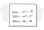
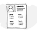
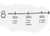
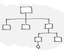
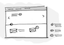

# Introduction

## Project Overview
UX/UI design case study focused on usability evaluation and user experience analysis within the digital restaurant context. Developed as part of the User Interfaces Design course in the BS in Computer Science at the University of Granada (UGR), this project comprises a comprehensive user research and evaluation phase (including accessibility audits, SUS questionnaires, A/B testing, and eye-tracking analysis) followed by the design and implementation of a fully functional web application featuring an advanced burger customization system for a local restaurant.

Original repository submitted to the university: [UX_CaseStudy](https://github.com/DIU3-DarkPatterns/UX_CaseStudy)
 
Our WEB: [clearburger-diu3.surge.sh](https://clearburger-diu3.surge.sh)

## Structure
This project is divided into 5 phases or steps (P1, P2, P3, P4 and P5), which will be described in detail below.

## Recognition
This project was added to the Hall of Fame of the subject (which can be seen here: [DIU Hall of Fame](https://github.com/mgea/DIU/tree/master/hall_of_fame)) recognizing it among the six top-performing case studies of the promotion.

## Team members:
 * :bust_in_silhouette: Roberto González Lugo - [@roberlks](https://github.com/roberlks)
 * :bust_in_silhouette: Antonio Alcalá-Galiano Sánchez - [@antonio-ags](https://github.com/antonio-ags) / [@aags25](https://github.com/aags25)
-----

 

# Design Process 

 

## Step 1: UX User & Desk Research & Analysis 

Case study worked on in P1: **Goiko**.
- [Specific Readme for Phase 1](P1/DIUP1/README.md)

### 1.a User Research Plan

-----

A research plan focused on Goiko's usability was established, combining qualitative techniques (interviews) and quantitative techniques (timed task tests), focusing on three key actions: reservation, location lookup, and access to price/ingredient/allergen information.

Main document:
- [Complete User Research Plan](P1/UserResearchPlan/UserResearchPlan.md)

### 1.b Competitive Analysis

-----

Goiko was compared with two direct competitors in the same segment:
- Sancho Casual Burger
- Capital Burger

Main conclusions from the analysis:
- Goiko stands out for its clarity and order in presenting information.
- There is a significant gap in price visibility compared to the competition.
- Opportunities are detected in visual ambiance and commercial content hierarchy.

Documents:
- [Competitive Analysis (argued analysis)](P1/CompetitiveAnalysis/competitive_analysis_goiko.md)
- [Competitive Analysis (comparative table)](P1/CompetitiveAnalysis/Competitor_Analysis.pdf)

### 1.c Personas

-----

Two representative profiles were defined to evaluate needs and usage friction points:
- **María García**: planner profile, sensitive to allergen and price information.
- **Javier López**: dynamic profile, focused on fast ordering/booking and a smooth mobile experience.

Documents:
- [María García Persona + Journey Map](P1/Personas%20%26%20User%20Journey%20Maps/Persona%20%26%20User%20Journey%20Map_MariaGarcia%28goiko%29.pdf)
- [Javier López Persona + Journey Map](P1/Personas%20%26%20User%20Journey%20Maps/Persona%20%26%20User%20Journey%20Map_JavierLopez.pdf)

### 1.d User Journey Map

----

The journey maps model two different usage goals:
- Informed decision-making prior to reservation (planner user).
- Quick order/reservation execution in a social and mobile context (agile user).

Both journeys allow the detection of friction points in critical information, decision times, and operational steps.

Documents:
- [María García Journey](P1/Personas%20%26%20User%20Journey%20Maps/Persona%20%26%20User%20Journey%20Map_MariaGarcia%28goiko%29.pdf)
- [Javier López Journey](P1/Personas%20%26%20User%20Journey%20Maps/Persona%20%26%20User%20Journey%20Map_JavierLopez.pdf)

### 1.e Usability Review

----

A structured heuristic review (UX for the Masses) was applied to evaluate navigation, clarity, content, and main task support.

- **Evaluated URL**: https://www.goiko.com/es/
- **Rating obtained**: **70/100 (Good)**
- **Strengths**: visual clarity and basic navigation structure.
- **Weaknesses**: price/allergen visibility, mobile fluidity, and simplification of conversion actions.

Document:
- [Usability Review Report](P1/UsabilityReview/Usability-review.pdf)

### 1.f Briefing

To conclude Phase 1, an executive briefing was prepared that synthesizes findings, priorities, and improvement lines for the next design phase.

Document:
- [Executive Briefing](P1/Briefing/briefing.md)

 

## Step 2: UX Design  

- [Specific and complete P2 Readme](P2/README.md)

### 2.a Reframing / IDEATION: Empathy Map 
 
----

To approach the design and better understand the latent needs identified in Practical Work 1 (such as the lack of visibility in prices and allergens), we developed an Empathy Map. This tool allowed us to identify the main *pains* (frustrations) and *gains* (joys/expectations) of our target user when interacting with an online restaurant service.

**Problem and Hypothesis:** The competition lacks transparent product configuration and agile reservation processes. Our hypothesis is that by simplifying the "Create My Own Burger" flows, while maintaining full visibility of ingredients and prices in real-time, conversion and user satisfaction for the planner profile will significantly increase.

.png)

### 2.b ScopeCanvas

----

We have grounded our "DarkPatterns" value proposition through a Scope Canvas, clearly delimiting our objectives (transparency and agility), user needs, and key required features (dynamic customizer, simplified reservation in a few steps, allergen labeling).

%20(Copy)%20(Copia).png)

### 2.c User Flow (Task Analysis)
 
-----

We have analyzed and modeled the most critical task flows to ensure navigation is intuitive and friction-free. Three main *User Flows* were defined:

1. **Create Burger:** Core flow to customize a product from scratch and add it to the order. [View Flow](P2/CrearHamburguesa.png)
2. **Book a Table:** Sequential and agile flow to secure a table without doubts or distractions. [View Flow](P2/ReservarMesa.png)
3. **Access Account:** Classic user registration/login flow. [View Flow](P2/AccederaCuenta.png)

### 2.d IA: Sitemap + Labelling 
 
----

We defined the application structure and precise nomenclature with the goal of speaking the user's language and organizing information logically.

**Sitemap:**

**Labelling:**
The table detailing the meaning of each navigation term has been documented in the following file:
- [Labelling Document (PDF)](P2/Labelling.pdf)

### 2.e Wireframes (Lo-Fi)
 
-----

To validate the previous flows, we designed low-fidelity (Lo-Fi) wireframes for a Web Desktop environment (1440px), using a structured 12-column grid. 

The goal was to define the visual hierarchy of key components (interactive prices, customizer, allergen filters). The following main screens were designed:

- **Home:** 

- **Product Menu:** 

- **Burger Customizer (Key Screen):** 

- **Reservation Process:** 

Screens can be viewed directly in the [internal P2 document](P2/README.md).

 

## Step 3: My UX-Case Study (Design)

- [Specific and complete P3 Readme](P3/readme.md)

### 3.a Moodboard

-----

Complete visual design of the **ClearBurger** brand identity, created in Figma. The Moodboard defines the visual language of the project: dark mode palette (Carmine Red #D92525, Carbon Black #1A1A1A, Bone White #F5F5F5), Montserrat Bold (headings) + Inter (body) typography, urban/industrial aesthetic with product photography on dark backgrounds.

The logo is a bold-stroke imagotype, combining red and black to convey energy and modernity. The Moodboard format is optimized for screens and presentations; for social media use like Instagram, it would require adaptation to a square (1:1) or vertical (4:5) format.

Documents:
- [View Moodboard in Figma](https://www.figma.com/design/eV5CyeyMHPOjrAd9HuXekq/Untitled?node-id=0-1&t=M9fE7HbpVGV4a53N-1)
- [Download Moodboard PDF](P3/Moodboard-P3_DarkPatterns.pdf)

### 3.b Landing Page

----

**ClearBurger** Landing Page generated using **Figma Make** (Vibe Coding/Design), applying the visual system from the Moodboard. The generation process was based on iterative prompts specifying the objective (dark-pattern-free restaurant), visual style (dark mode, red/black), and content structure (headline + benefits + CTA). The page highlights three differential values: transparent pricing, always-visible allergens, and zero artificial urgency.

- [View Published Landing Page](https://trade-editor-25618488.figma.site)

### 3.c Visual Language — Design System

----

Lightweight Design System built using the **Atomic Design** methodology in Figma. Generated with the **Foundation Studio** plugin for base tokens and developed manually with variants and Autolayout for components.

**Key design decisions:**
- Semantic color system with named tokens (Primary, Neutrals, Feedback) for future integration with Tailwind CSS.
- Modular typographic scale based on 8px: Montserrat for H1–H5, Inter for Paragraph and Small.
- Figma component variants: Button (4), Input (3), Badge (3), SearchBar (3), ListItem (10), Card (3), Navbar, and Footer.
- Autolayout across all components for responsive behavior.

- [View Design System in Figma](https://www.figma.com/design/hSSaOkXlwwd5DqxbSwdTj9/Design-system?node-id=0-1&t=3GDIyxNABywiV3ie-1)

### 3.d Layout Hi-Fi

----

Hi-Fi prototype in Figma of the four main ClearBurger screens, applying the complete Design System (components, typography, colors, and spacing). Desktop 1440px layout in dark mode with semantic visual hierarchy (header → content → footer) across all screens.

**Published interactive prototype:** [View prototype](https://dazzle-pages-38852614.figma.site)

**Figma file:** [View design in Figma](https://www.figma.com/proto/hSSaOkXlwwd5DqxbSwdTj9/Design-system?node-id=106-1123&t=3GDIyxNABywiV3ie-1)

| Screen | Description |
|----------|-------------|
| Home | Welcome screen with hero section and featured burgers |
| Menu (Carta) | Product list with search and allergen filters |
| Customize | Burger customizer with real-time pricing |
| Reserve | Simplified booking form with no hidden fees |

### 3.e Briefing

The entire design process for this assignment was carried out entirely within **Figma**, taking advantage of both its native features and the community plugin ecosystem. For generating the Design System Foundations, the **Foundation Studio** plugin was used, which automated the creation of semantic color ramps, modular typographic scales, and the 8px-based spacing system, establishing a solid and coherent base to build the rest of the components upon. From there, the Design System was developed manually by applying variants, Autolayout, and component properties to ensure consistency and reusability throughout the prototype.

The use of **conversational AI tools** (ChatGPT and Claude) proved especially valuable throughout the assignment as real-time technical support. When working with a tool as comprehensive as Figma, very specific questions constantly arise: how to correctly structure component variants, how to configure Autolayout to behave responsively, what the difference is between constraints and resizing, or how to connect screens in Prototype mode. Consulting these questions directly with an AI instead of searching through documentation or tutorials drastically reduced blocking times and kept the workflow moving without interruptions.

In conclusion, combining Figma with specialized plugins and AI as a technical assistant has proven to be a highly efficient workflow for Hi-Fi prototyping. AI does not replace design judgment; rather, it eliminates technical friction, allowing us to focus on the UX decisions that truly matter.

 

## Step 4: Evaluation Tests

### 4.a User Recruitment
To carry out this phase, due to time constraints, we were able to assemble a sample of 5 users, of which 3 were key users who underwent the Eye Tracking test. The participant details are:

| ID | Age | Gender | Digital Literacy |
| :---- | :---- | :---- | :---- |
| P1 | 21 | Male | High |
| P2 | 21 | Male | High |
| P3 | 52 | Female | Medium |

Regarding the conditions under which the eye-tracking test was conducted, all users removed their glasses if they wore them, meaning everyone performed the test with an uncovered face. Lighting was natural, and the test was performed on a laptop.   

The first two users are classmates, so they are familiar with this type of test as they are studying them as well. The other two have never participated and are not familiar with them at all. P1 and P2 are students, while P4 can be considered an end-user, as someone without computer science knowledge who frequently uses this type of web page.  

On the other hand, to carry out the rest of the tests, the 3 users evaluated both cases, but 2 of them evaluated Case B (our peers' website, as we simulate a competitor analysis) first, and the remaining one evaluated Case A (our website) first.

### 4.b Test Design
We now move on to the user usability testing of the designs. The tasks assigned to them are:  
* **Case A: Our website (Burger Creator):** The user is asked to imagine they are going to dine at Goiko and want to create a burger that fully fits their tastes and allergen requirements.  
* **Case B: Competitor website (Goiko Finder):** The user is asked to choose the burger and location they like best for an upcoming meal.

### 4.c SUS Questionnaire

**Case A SUS Questionnaire:**

**P1:**
| | Questions | 1 | 2 | 3 | 4 | 5 |
| :---- | :---- | :---- | :---- | :---- | :---- | :---- |
| 1 | I think that I would like to use this system frequently | | | | | x |
| 2 | I found the system unnecessarily complex | | x | | | |
| 3 | I thought the system was easy to use | | | | | x |
| 4 | I think that I would need the support of a technical person to be able to use this system | | x | | | |
| 5 | I found the various functions in this system were well integrated | | | | x | |
| 6 | I thought there was too much inconsistency in this system | x | | | | |
| 7 | I would imagine that most people would learn to use this system very quickly | | | | x | |
| 8 | I found the system very cumbersome to use | | | x | | |
| 9 | I felt very confident using the system | | | | x | |
| 10 | I needed to learn a lot of things before I could get going with this system | x | | | | |

**P2:**  
| | Questions | 1 | 2 | 3 | 4 | 5 |
| :---- | :---- | :---- | :---- | :---- | :---- | :---- |
| 1 | I think that I would like to use this system frequently | | | | | x |
| 2 | I found the system unnecessarily complex | x | | | | |
| 3 | I thought the system was easy to use | | | | x | |
| 4 | I think that I would need the support of a technical person to be able to use this system | x | | | | |
| 5 | I found the various functions in this system were well integrated | | | | x | |
| 6 | I thought there was too much inconsistency in this system | x | | | | |
| 7 | I would imagine that most people would learn to use this system very quickly | | | | | x |
| 8 | I found the system very cumbersome to use | | x | | | |
| 9 | I felt very confident using the system | | | | | x |
| 10 | I needed to learn a lot of things before I could get going with this system | x | | | | |

**P3:**  
| | Questions | 1 | 2 | 3 | 4 | 5 |
| :---- | :---- | :---- | :---- | :---- | :---- | :---- |
| 1 | I think that I would like to use this system frequently | | | | | x |
| 2 | I found the system unnecessarily complex | | x | | | |
| 3 | I thought the system was easy to use | | | x | | |
| 4 | I think that I would need the support of a technical person to be able to use this system | | x | | | |
| 5 | I found the various functions in this system were well integrated | | | | x | |
| 6 | I thought there was too much inconsistency in this system | x | | | | |
| 7 | I would imagine that most people would learn to use this system very quickly | | | | x | |
| 8 | I found the system very cumbersome to use | | | x | | |
| 9 | I felt very confident using the system | | | | x | |
| 10 | I needed to learn a lot of things before I could get going with this system | | x | | | |

| User | SUS Score | Linguistic Rating |
| :---- | :---- | :---- |
| P1 | 82.5 | Excellent |
| P2 | 92.5 | Best Imaginable |
| P3 | 75 | Good |

**Case B SUS Questionnaire:**

**P1:**
| | Questions | 1 | 2 | 3 | 4 | 5 |
| :---- | :---- | :---- | :---- | :---- | :---- | :---- |
| 1 | I think that I would like to use this system frequently | | | | | x |
| 2 | I found the system unnecessarily complex | | x | | | |
| 3 | I thought the system was easy to use | | | | | x |
| 4 | I think that I would need the support of a technical person to be able to use this system | x | | | | |
| 5 | I found the various functions in this system were well integrated | | | x | | |
| 6 | I thought there was too much inconsistency in this system | | x | | | |
| 7 | I would imagine that most people would learn to use this system very quickly | | | x | | |
| 8 | I found the system very cumbersome to use | | | | x | |
| 9 | I felt very confident using the system | | | | x | |
| 10 | I needed to learn a lot of things before I could get going with this system | x | | | | |

**P2:**  
| | Questions | 1 | 2 | 3 | 4 | 5 |
| :---- | :---- | :---- | :---- | :---- | :---- | :---- |
| 1 | I think that I would like to use this system frequently | | | | | x |
| 2 | I found the system unnecessarily complex | | x | | | |
| 3 | I thought the system was easy to use | | | | x | |
| 4 | I think that I would need the support of a technical person to be able to use this system | x | | | | |
| 5 | I found the various functions in this system were well integrated | | | | x | |
| 6 | I thought there was too much inconsistency in this system | x | | | | |
| 7 | I would imagine that most people would learn to use this system very quickly | | | x | | |
| 8 | I found the system very cumbersome to use | | | x | | |
| 9 | I felt very confident using the system | | | | | x |
| 10 | I needed to learn a lot of things before I could get going with this system | x | | | | |

**P3:**  
| | Questions | 1 | 2 | 3 | 4 | 5 |
| :---- | :---- | :---- | :---- | :---- | :---- | :---- |
| 1 | I think that I would like to use this system frequently | | | | | x |
| 2 | I found the system unnecessarily complex | | | x | | |
| 3 | I thought the system was easy to use | | | x | | |
| 4 | I think that I would need the support of a technical person to be able to use this system | | x | | | |
| 5 | I found the various functions in this system were well integrated | | | | x | |
| 6 | I thought there was too much inconsistency in this system | | x | | | |
| 7 | I would imagine that most people would learn to use this system very quickly | | | | x | |
| 8 | I found the system very cumbersome to use | | | | x | |
| 9 | I felt very confident using the system | | | | x | |
| 10 | I needed to learn a lot of things before I could get going with this system | | x | | | |

| User | SUS Score | Linguistic Rating |
| :---- | :---- | :---- |
| P1 | 75 | Good |
| P2 | 82.5 | Excellent |
| P3 | 67.5 | Good |

### 4.d A/B Testing

We will perform the same tests as in the previous section:

**Case A:**

| User | Success | Time |
| :---- | :---- | :---- |
| P1 | Yes | 45s |
| P2 | Yes | 51s |
| P3 | Yes | 1m 10s |

**Case B:**

| User | Success | Time |
| :---- | :---- | :---- |
| P1 | Yes | 25s |
| P2 | Yes | 32s |
| P3 | Yes | 47s |

We can observe that both websites are sufficiently well-designed for users to successfully accomplish what is requested of them. It can be seen that Case B times are somewhat faster, but we believe this is because the Case A task is somewhat more complex and lengthy.

### 4.e Eye Tracking Method Application

The images we will use to evaluate our peers' website (simulating a competitor analysis) via gaze mapping are the following:

Regarding points of interest, we selected the parts we considered most important on the website due to the information they provide, which are: food and venue photography, prices, the restaurant location map, and the names of each menu component...

Regarding the actions the user had to perform, we asked them to browse the website as if they were interested in ordering a burger, and to carry out tasks such as finding the reservation button, allergens, different locations, or establishment availability. In this way, we aim to have them investigate information such as prices, ingredients, or locations...

The heatmap results for the different participants were as follows:

**P1:**

We can observe that this user glanced over the entire website very quickly, analyzing every detail and focusing primarily on cards for both burgers and restaurants. It is also clear that they barely looked at the map, so this feature went completely unnoticed by them.

**P2:**

Analyzing this user, we realized they looked primarily at the photos, and in some cases also paid close attention to the information. Thus, we assume this user tends to focus on images and, if they catch their attention, moves on to read the details of the product or establishment. Something similar happened in the menu, as they focused on very specific parts rather than analyzing everything.

**P3:**

Lastly, we have subject P3, who, as we can see, looked at everything with extreme attention, both images and text. In the menu, they also looked at practically every option.

**Eye Tracking Conclusions:**
In conclusion, evaluating the three cases, we can infer that younger people, perhaps due to being more familiar with technology, tend to pay much less attention to content and look at everything much faster, focusing only on what interests them. On the other hand, as we can see thanks to P3, slightly older people with less digital experience tend to pay close attention to all details, since they do not know exactly what is important and what is not. 

Thus, we believe the most appropriate approach would be to try simplifying the design slightly to better accommodate less familiar users, reducing the number of items they have to look at and clearly highlighting what is most important. Our recommendations for improvement would be:
1. Reduce the items in the grid and make them larger, so they stand out more and the interface is simpler. The text description and the "show details" button are very appropriate, as they contribute to this simplicity (since you only see details if the burger catches your attention). The right sidebar menu also seems like a very good idea, as it provides a lot of information in a very quick and easy-to-read format.
2. The menu section would improve significantly if it included photographs to make it more visual, since text-only layouts can become very monotonous and difficult for some users to understand.
3. Finally, we noticed that none of the 3 subjects paid much attention to the map section. Since this is quite an important feature, it could be made more prominent to draw attention—for example, by using brightly colored pins indicating exact locations and placing restaurant info in a spot that does not obstruct the content.

On the other hand, we observed that users correctly focused on the points of interest, although as mentioned before, the map (which was one of them) acted as a silent zone where they barely looked.

### 4.f Competitor usability report

Usability Evaluation of the Goiko Finder Project

**Executive Summary**

In this analysis, we evaluated the Goiko Finder proposal, whose functionality is based on simplifying navigation across Goiko's website and making it much clearer and faster.   

The main aspects evaluated were website clarity across users of different ages and levels of technical familiarity, as well as its interface usability.  

To achieve this, users performed several tests. The first was Gaze Mapping, which allowed us to see which aspects of the website catch users' attention the most and whether it is easy to find and access basic and essential features.   

The subsequent tests involved asking users to perform various tasks, followed by filling out a SUS questionnaire to measure usability and user experience when using the website. Additionally, A/B testing was conducted by timing subjects during these tasks to estimate average completion times.

As critical pain points, we found first that the burger and restaurant grid features many elements, which can hinder the experience for users with lower digital literacy. On the other hand, the menu section felt monotonous since it consists of multiple text boxes without any product images or illustrations. Finally, during testing, we noticed that users barely looked at the restaurant location map, indicating it should be made more prominent.

The SUS questionnaire results were quite positive, with an average score of 75, indicating that the user experience and ease of use when navigating the website were quite high, making the design acceptable overall.

**Accessibility Audit** 
The primary positive aspects identified are:
* **Text Contrast:** High-contrast dark typography against light containers meets WCAG requirements (minimum 4.5:1 ratio for normal text).
* **Non-Color Indicators:** Spicy dishes include a flame icon next to the text, complying with the guideline to avoid using color as the sole means of conveying information.

Conversely, we observed that in the daily menu section, there is gray and gold text over a textured black background, which fails to reach the required contrast ratio for low-vision users.

**Actionable Insights**

| Priority | Finding | Improvement Recommendation |
| :---- | :---- | :---- |
| **High** | Text contrast in the daily menu section is inadequate for low-vision users. | Change the font color or background to improve contrast for better legibility. An example would be using white text, since black and white make this section quite legible. |
| **High** | The restaurant location map is a silent zone that users barely looked at, despite being an important feature. | Relocate restaurant information away from the map overlay and add bright, prominent location markers. Another solution could be moving the section elsewhere, such as the right sidebar, where it is more visible. |
| **Medium** | The burger and restaurant grid contains excessive content, making it overly complex and hard to understand for some users. | Simplify the grid to feature only two columns and enlarge images to make the interface simpler, more visual, and easier to understand. |
| **Medium** | The menu is monotonous because it consists of text only, making reading all its items a long, tedious task that is difficult to digest. | Add product images next to the names and slightly enlarge elements to improve visual appeal and clarity. |

## Step 5: Export and Documentation 

### 5.a HTML/React Export
 
----

The ClearBurger web application was developed using **React 19 + Vite** as the production environment, applying **Tailwind CSS v4** as the styling engine and **shadcn/ui** (Nova preset with Lucide icons) as the base for accessible components. The architecture follows the **Atomic Design** methodology from the P3 Design System, structuring elements into three levels: atoms (`Button`, `Tag`, `Input`), molecules (`SearchBar`, `IngredientButton`), and organisms (`Navbar`, `Footer`).

The implemented design faithfully respects the visual system defined in Figma: a dark mode palette with a `#1A1A1A` background, `#222222` surface, `#D92525` CTA red, and Montserrat/Inter typography. The floating pill-shaped navbar, the footer with its link grid, and the four main flows (Home, Menu, Customize, and Reserve) reproduce the Hi-Fi prototype with full interactivity: search and category filtering in the Menu, a customizer with real-time price calculation in Customize, and a reservation form with inline field validation in Reserve.

**App published in production:** [clearburger-diu3.surge.sh](https://clearburger-diu3.surge.sh) — Evidence is located in [P4/clearburger/](P4/clearburger/).

### 5.b Documentation with Storybook

----

The component library is documented using **Storybook** (v10, React + Vite integration). Stories have been written for the five custom components of the Design System, organized into the same categories as Figma's Atomic Design:

- **Atoms:** `Button` (primary / secondary / ghost / disabled), `Tag` (default · warning · neutral), `Input` (default · focus · error)
- **Molecules:** `SearchBar` (default · active · error), `IngredientButton` (available · selected · out of stock)

Each story uses `autodocs` to generate interactive documentation with a props table and real-time controls. The Storybook environment applies the same dark mode and CSS of the design system, ensuring visual fidelity between the documentation and the application.

To run: `npm run storybook` (port 6006). The static build is generated with `npm run build-storybook`.

